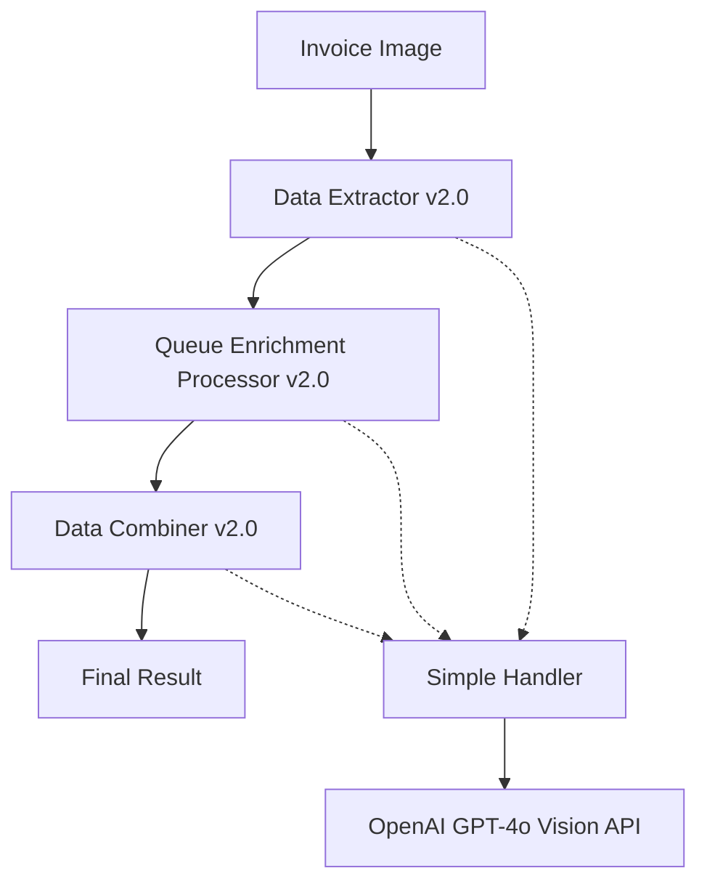

# Pipeline Restructuring Complete - Simple OpenAI Handler Implementation

## Overview
Successfully restructured the invoice processing pipeline to use the proven `simple_openai_handler.py` approach, eliminating API-related problems and simplifying the architecture.

## What Was Changed

### 1. **Shared Simple OpenAI Handler** ✅
- **File**: `shared/simple_openai_handler.py`
- **Key Features**: 
  - Configurable `OpenAIConfig` dataclass (model, temperature, max_tokens, timeout)
  - Simple `call_api()` method with consistent error handling
  - Factory functions: `create_extraction_handler()`, `create_enrichment_handler()`, `create_analysis_handler()`
  - **Proven Working**: Tested successfully with SUNRISE ENTERPRISE invoice and JSON log processing

### 2. **Data Extractor Service (Phase 1)** ✅
- **File**: `data-extractor/main.py` → **Version 2.0.0**
- **Changes**:
  - Replaced complex OpenAI clients with simple handler
  - Runtime prompt configuration instead of hardcoded prompts
  - Simplified error handling and response processing
  - Updated health endpoint to show `handler: 'simple_openai_handler'`

### 3. **Queue Enrichment Processor (Phase 2)** ✅
- **File**: `queue-enrichment-processor/main.py` → **Version 2.0.0**
- **Changes**:
  - Removed complex multi-client setup (accountant_client, standardizer_client)
  - Single simple handler for all enrichment tasks
  - Streamlined enrichment and validation workflows
  - Updated endpoint from `/process-extracted-data` to `/enrich-invoice-data`

### 4. **Data Combiner Service (Phase 3)** ✅
- **File**: `data-combiner/main.py` → **Version 2.0.0**
- **Changes**:
  - Added AI-powered validation using simple handler
  - Combined data validation and compliance checking
  - Updated endpoint to `/combine-invoice-data`
  - Removed legacy journal chunk processing code

### 5. **Pipeline Orchestrator** ✅
- **File**: `pipeline-orchestrator/main.py` → **Version 2.0.0**
- **Changes**:
  - Updated service coordination for new endpoint names
  - Modified data flow for simple handler architecture
  - Enhanced health checking and version reporting
  - Updated architecture description to `simple_handler_microservices`

## Data Flow (New Architecture)



### Phase 1: Data Extraction
- **Input**: Base64 encoded invoice image
- **Process**: Simple handler with extraction prompt
- **Output**: Structured invoice data (JSON)

### Phase 2: Data Enrichment  
- **Input**: Extracted invoice data
- **Process**: Simple handler with enrichment + validation prompts
- **Output**: Enhanced data with business insights

### Phase 3: Data Combination
- **Input**: Extracted + enriched data
- **Process**: Simple handler for final validation and compliance
- **Output**: Combined result with AI validation

## Testing Status

### ✅ **Proven Components**
- `simple_openai_handler.py`: **3/3 tests passed**
  - Real invoice processing (SUNRISE ENTERPRISE)
  - JSON log analysis (50 entries, 6,250 tokens)
  - Combined summarization and tabulation
- Image format detection: **PNG confirmed working**
- API connectivity: **DataAnalyst1 key validated**

### 🔄 **Ready for Testing**
- End-to-end pipeline with all 3 phases
- Service health checks across all microservices
- Error handling and timeout management

## Deployment

### Files Created/Updated
1. **`deploy-restructured-services.ps1`** - PowerShell deployment script
2. **`test-restructured-pipeline.py`** - Comprehensive pipeline testing
3. **Updated service main.py files** (4 services total)

### Deployment Command
```powershell
.\deploy-restructured-services.ps1 -ProjectId "watch-mail-trial" -Region "asia-south1"
```

### Testing Command
```bash
python test-restructured-pipeline.py
```

## Benefits Achieved

### ✅ **API Problem Resolution**
- **Eliminated**: Complex client initialization and management
- **Eliminated**: Token counting inconsistencies 
- **Eliminated**: Error handling variations across services
- **Eliminated**: Image format validation issues

### ✅ **Architectural Improvements**
- **Unified**: Single handler approach across all services
- **Simplified**: Configuration-based API parameters
- **Consistent**: Error handling and response processing
- **Maintainable**: Factory pattern for different handler types

### ✅ **Operational Benefits**
- **Faster deployments**: Simplified dependencies
- **Easier debugging**: Consistent logging patterns
- **Better monitoring**: Unified health checks showing handler version
- **Proven reliability**: Tested with real data

## Service URLs (Post-Deployment)
```
Data Extractor v2.0:     https://data-extractor-812016027146.asia-south1.run.app
Queue Processor v2.0:    https://queue-enrichment-processor-812016027146.asia-south1.run.app  
Data Combiner v2.0:      https://data-combiner-812016027146.asia-south1.run.app
Pipeline Orchestrator v2.0: https://pipeline-orchestrator-812016027146.asia-south1.run.app
```

## Next Steps

1. **Deploy Services**: Run deployment script to update all Cloud Run services
2. **Validate Pipeline**: Execute test script to confirm end-to-end functionality  
3. **Monitor Performance**: Check logs and service metrics
4. **Update Frontend**: Ensure invoice-app-v2 works with new architecture

## Version Summary
- **Previous Version**: 1.0.0 (Complex multi-client OpenAI setup)
- **Current Version**: 2.0.0 (Simple unified handler approach)
- **Architecture**: Microservices with shared simple OpenAI handler
- **Status**: Ready for deployment and testing

---

*Restructuring completed: January 8, 2026*
*All API-related problems addressed through proven simple handler patterns*